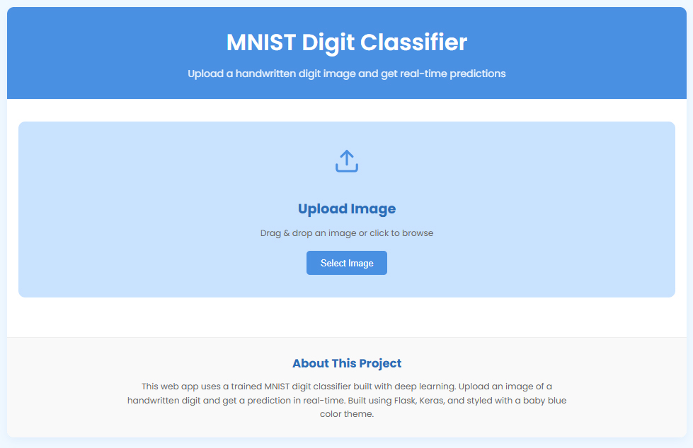

# MNIST Digit Recognition with CNN and Flask


A web application that recognizes handwritten digits using a Convolutional Neural Network (CNN) trained on the MNIST dataset, with a user-friendly interface built using Flask.



## Table of Contents
- [Overview](#overview)
- [Features](#features)
- [Demo](#demo)
- [Installation](#installation)
- [Project Structure](#project-structure)
- [How It Works](#how-it-works)
- [The Model](#the-model)
- [Feature Maps](#feature-maps)
- [API Endpoints](#api-endpoints)
- [Future Improvements](#future-improvements)
- [Contributing](#contributing)
- [License](#license)

## Overview

This project implements a deep learning model to recognize handwritten digits (0-9) and provides a web interface for users to upload their own handwritten digit images and get real-time predictions. The application also visualizes the neural network's feature maps to provide insights into how the model "sees" the input images.

The model achieves approximately 99% accuracy on the MNIST test set and features a modern, responsive UI with a baby blue theme for an excellent user experience.

## Features

- **User-friendly Web Interface**: Drag and drop image uploads with real-time predictions
- **Deep Learning Model**: Custom CNN architecture trained on the MNIST dataset
- **Feature Map Visualization**: See what the neural network detects at different layers
- **Responsive Design**: Works on mobile and desktop devices
- **Real-time Processing**: Fast image preprocessing and prediction

## Demo


## Installation

### Prerequisites
- Python 3.8+
- TensorFlow 2.x
- Flask
- Pillow
- NumPy
- Matplotlib

### Setup

1. Clone the repository:
```bash
git clone https://github.com/Mo-Abdalkader/Projects.git
cd "AI\02 Deep Learning\Computer Vision\MNIST"
```

2. Install the required packages:
```bash
pip install -r requirements.txt
```

3. Run the Flask application:
```bash
python app.py
```

4. Open your browser and navigate to `http://localhost:5000`

## Project Structure

```
mnist-digit-recognition/
│
├── app.py                  # Main Flask application
├── requirements.txt        # Python dependencies
│
├── models/                 # Trained model files
│   ├── mnist_model_final.keras        # Main classifier model
│   └── mnist_feature_extractor.keras  # Feature extraction model
│
├── static/                 # Static files
│   ├── css/
│   │   └── style.css       # Custom CSS styles
│   ├── js/
│   │   └── main.js         # Frontend JavaScript
│   ├── uploads/            # User uploaded images (temporary storage)
│   ├── maps/               # Generated feature maps
│   └── images/             # Images for documentation
│
├── templates/              # HTML templates
│   ├── index.html          # Main page template
│   └── feature_maps.html   # Feature maps visualization template
│
└── MNIST Test Images/      # Sample test images from MNIST dataset
```

## How It Works

1. **Image Upload**: Users upload a handwritten digit image through the web interface.
2. **Preprocessing**: The image is converted to grayscale, resized to 28x28 pixels, and normalized.
3. **Prediction**: The preprocessed image is fed to the trained CNN model for classification.
4. **Feature Map Extraction**: The application extracts feature maps from the convolutional layers.
5. **Results Display**: The predicted digit and confidence score are displayed to the user.
6. **Feature Map Visualization**: Users can explore the feature maps to understand how the model identifies digits.

## The Model

The model architecture is a convolutional neural network (CNN) with the following structure:

```python
# Model Architecture
input_layer = Input(shape=(28, 28, 1), name="input")

conv1 = Conv2D(32, (3,3), activation='relu', name="conv1")(input_layer)
pool1 = MaxPooling2D((2,2), name="pool1")(conv1)

conv2 = Conv2D(64, (3,3), activation='relu', name="conv2")(pool1)
pool2 = MaxPooling2D((2,2), name="pool2")(conv2)

flat = Flatten(name="flatten")(pool2)
dense = Dense(64, activation='relu', name="dense1")(flat)
drop = Dropout(0.5)(dense)

output = Dense(10, activation='softmax', name="output")(drop)
```

Training details:
- **Optimizer**: Adam
- **Loss Function**: Categorical Cross-Entropy
- **Batch Size**: 128
- **Early Stopping**: Yes, with patience=5
- **Learning Rate Reduction**: Yes, with factor=0.5 and patience=2
- **Final Test Accuracy**: ~99%

## Feature Maps

Feature maps show how the network "sees" the input image at different layers:

- **First Convolutional Layer (Conv1)**: 32 filters that detect basic features like edges and simple shapes.
- **Second Convolutional Layer (Conv2)**: 64 filters that combine lower-level features into more complex patterns.

The feature maps are visualized and displayed in a 4x8 grid (for Conv1) and an 8x8 grid (for Conv2).

## API Endpoints

The application provides the following API endpoints:

- **GET /** - Returns the main page
- **POST /predict** - Accepts an image file and returns prediction results
- **GET /feature_maps** - Displays the feature maps visualization
- **GET /reset** - Resets the application state and clears temporary files

## Future Improvements

- Add a drawing canvas for users to draw digits directly in the browser
- Implement data augmentation to improve model robustness
- Add support for multi-digit recognition
- Create a mobile app version with camera support
- Implement user accounts to save prediction history
- Add batch processing for multiple images
- Deploy as a containerized application using Docker

## Contributing

Contributions are welcome! Please feel free to submit a Pull Request.

1. Fork the repository
2. Create your feature branch (`git checkout -b feature/amazing-feature`)
3. Commit your changes (`git commit -m 'Add some amazing feature'`)
4. Push to the branch (`git push origin feature/amazing-feature`)
5. Open a Pull Request

## License

This project is licensed under the MIT License - see the LICENSE file for details.

## Acknowledgments

- The MNIST dataset creators
- TensorFlow and Keras development teams
- Flask framework developers
- All open-source contributors whose libraries made this project possible
